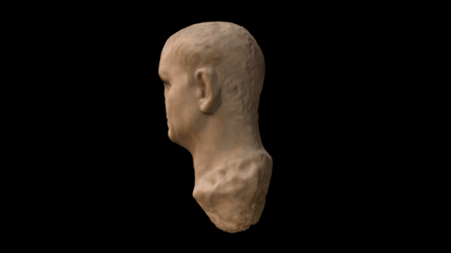

 

# A 3D model of the emperor Vespasian

3D data for recreation of a British Museum object.

Head from an over-life-sized marble statue of the emperor Vespasian, perhaps re-carved from a portrait of Nero. The nose is missing.

British Museum Collection Online: http://bit.ly/1OiWtDR

# LICENSE
The contents of this repository are licensed under CC-BY-NC-SA

# Credits
Photographs and models by Daniel Pett <dpett@britishmuseum.org>, Digital Humanities Lead, British Museum

Copyright Trustees of the British Museum
